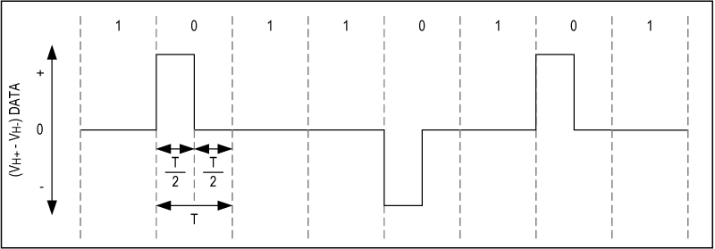

## Physical Level
The Hisense H-net protocol adopts the Home Bus System as its physical layer. This technology, originally developed in Japan for home automation, relies on a two-wire twisted pair bus capable of carrying both power (up to 36 V) and data simultaneously.
The network is arranged in a bus topology, with maximum lengths of 200 m in the standard version (ET-2101) and up to 1 km in the Extended Home Bus specification, which suits larger installations such as multi-apartment buildings or HVAC systems distributed across multiple floors.
Data transmission is performed at 9.6 kbaud (±0.13%) using a baseband signaling technique. The encoding scheme is Alternative Mark Inversion (AMI) with negative logic and a 50% duty cycle: each logic “0” alternates the polarity between the two lines, H⁺ and H⁻, ensuring DC balance.



Defined thresholds ensure reliable symbol detection:
* Logic “0” → 0.6 V (Vₗₗ)
* Logic “1” → 1.4 V (receive) / 2.5 V (transmit)
  
Bus arbitration uses Carrier Sense Multiple Access with Collision Detection (CSMA/CD), preventing data corruption when multiple nodes attempt simultaneous communication.
Since no dedicated clock line exists, synchronization is handled through start-stop framing, similar to UARTs. Each transmitted character consists of 11 bits, sent least significant bit first, and includes even parity for error detection.


## Data Frame
On top of this physical medium, the H-net protocol defines its own data frame structure. Each message is encapsulated into a frame that includes synchronization, addressing, and integrity checks.
A frame typically contains:
* Start delimiter → used to identify the beginning of a transmission.
* Header → includes addressing information to identify source and destination nodes.
* Payload → variable-length data field carrying commands, sensor values, or status information exchanged between indoor and outdoor units.
* Checksum/CRC → ensures the integrity of the frame, allowing devices to detect corrupted transmissions.

Frames are transmitted least significant bit first, following the UART-like start-stop convention inherited from the physical layer. The combination of parity at the character level and CRC at the frame level provides two layers of error detection, making the protocol robust against line disturbances typical of long twisted-pair cabling.

|SOURCE ADDRESS|CONTROL BYTE| MESSAGE LENGTH (len) |PAYLOAD |	CHECKSUM |
|--|--|--|--|--|
|xx|	xx|	xx|	xx … xx	|xx |
|1 Byte |	1 Byte | 1 Byte | (len – 4 )  Byte	| 1 Byte |

Messages are broadcasted on the bus: there is indeed no destination address I could find. The control byte is used to acknowledge requests made on the bus: in this case the frame is composed only of the source address followed by a 0x06.

|SOURCE ADDRESS|CONTROL BYTE|
|--|--|
|xx|06|

During my captures I never stumbled upon a NAK packet but I am confident the control byte could change to 0x15 — the standard ASCII code for NAK, as opposed to 0x06 which stands for ACK. This could lead to a retransmission of the corrupted message but it is just my guess. The message length is the total number of bytes transmitted, checksum included. 

## Checksum Calculation
The last byte is used for error detection and is computed using a simple XOR-based algorithm: the checksum starts with a 0x00 seed, performs a sequential XOR over all data bytes, and applies a final XOR with the source address. To figure out this I collected a good number of packets (~ 50) and I wrote a script to check with the most common checksum algorithms. Below is an implementation of the matching algorithm in python :

```python
checksum = 0
data = msg[:-1]
src_address = msg[0]
for byte in data:
    checksum ^= byte
checksum ^= src_address
```
